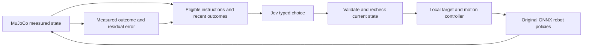

# Jevduck

**A browser research simulator for typed AI decisions over physically simulated robots.**

[Open the simulator](https://jevduck.vercel.app/) · [Validation record](docs/VALIDATION.md) · [Upstream Microduck simulator](https://huggingface.co/spaces/pollen-robotics/microduck-simulator)

Jevduck asks a concrete question: **can a model choose useful next actions from measured robot state while a separate controller makes execution bounded and its outcome inspectable?** It connects [Jev's typed decisions](https://docs.typesafe.ai/api) to the official Microduck simulator. MuJoCo WebAssembly computes the robot dynamics in the browser; the original ONNX policies control the articulated joints. A server handles Jev requests with a private API key.

The experiment sits between an instruction and the motion it actually produces. “Advance the formation” is a decision. Reaching the assigned positions is a physical result that has to be measured. Jevduck keeps those events separate: an accepted instruction can stop short of its targets even when the robots move. The remaining error stays in its history.

The initial scene contains two independently controlled robots. Four-robot scenarios test formation motion and repeated changes of group arrangement in a shared 3 × 3 m arena. Individual experiments also cover ball approach with verified kick contact. Posture prerequisites are checked before movement. The simulator source and model assets are included; it does not embed a remote Hugging Face page.

This is an experimental system, with working demonstrations and retained failures. The group controller uses engineered target slots and shared simulator measurements. It does not establish decentralized swarm intelligence or physical-hardware performance. No controlled comparison yet shows that Jev outperforms a deterministic supervisor.

## Research design

Jev makes a bounded discrete choice. Local code determines which choices are currently admissible and executes the selected one through the existing robot policies. Physics provides the next observation.



| Component | Responsibility | Boundary |
| --- | --- | --- |
| Jev | Interpret supported requests or select the next eligible group instruction | Does not generate joint positions or certify success |
| Session controller | Correlate commands with fresh runtime receipts; retain outcomes and revoke control after interruption | Does not infer completion from an idle interface alone |
| Native controller | Assign distinct formation slots and choose bounded walking arcs using measured geometry | Uses engineered steering around the original policies |
| MuJoCo and ONNX | Step shared physical contacts and run each robot's policy observations/history independently | Simulation is not evidence of real-robot transfer |

Group choices are `advance`, `regroup`, `disperse`, `change_leader`, `split`, and `hold`, restricted by the selected scenario and current capabilities. Jev receives the group measurements together with recent physical outcomes. The application checks the returned distribution and requires a decision score of at least 0.55 for movement. These scores are model outputs, not calibrated success probabilities. An unavailable or invalid response stops group control; there is no scripted movement fallback.

The group loop requests a decision at most once every eight wall-clock seconds. A native movement window lasts at most eight simulated seconds. It needs current observations less than two seconds old and uses correlated run/command identifiers, so an old reply cannot revive a cancelled session. The control-rate target is 50 Hz; model calls run outside the physics loop.

An ineffective advance is removed from the available choices until an admitted recovery changes the formation or leadership. Recovery alternatives are bounded. Quiet holds preserve the preceding movement evidence, rather than replacing a failed attempt with apparently clean history. If useful movement is exhausted in the finite arena, holding is a valid result.

## Experiments and measurements

Open **Simulations** and choose **Run**. Each scenario explicitly initializes a four-robot layout before Jev takes control. Target rings show assigned positions; trails follow measured motion.

| Scenario | Experiment | What to inspect |
| --- | --- | --- |
| Flocking formation | Advance a prepared formation, with regrouping or spacing changes available | Group translation and maximum target error |
| Aggregation | Alternate compact and wider assigned formations | RMS group spread and reduction in each stage's target error |
| Leader convoy | Advance under a designated leader; admit leadership change after ineffective progress | Leader identity alongside actual translation |
| Split & regroup | Separate into assigned pairs and return to a compact formation | Whether both stages reach low residual error across repeated windows |

The interface reports quantities in metres:

| Metric | Definition | Interpretation |
| --- | --- | --- |
| RMS spread | Root mean square planar distance of members from their centroid | Group compactness |
| Minimum spacing | Smallest planar distance between any two body centres | Geometric separation; not a substitute for a contact check |
| Centroid displacement | Distance between the current and starting centroid for one instruction | Net translation, not path length or formation quality |
| Maximum slot error | Largest planar distance from a member to its own assigned target | Residual positioning error, or unassigned before a target exists |

**“Window ended” does not mean “formation achieved.”** The native arrival tolerance is 0.075 m, with arrival hysteresis. The higher-level alternating scenarios permit a next stage at maximum slot error no greater than 0.15 m. Both differ from the stricter 0.13 m repeated-window research check, which remains a reproducible failed test for some trajectories.

The 2026-09-18 release passed 285 application tests and 135 native simulator tests. The native tests include actual MuJoCo/ONNX stepping with four independently controlled robots. Prepared first-stage scenarios moved every member without falls or inter-robot contact in the tested runs. Repeated windows exposed a remaining error of 0.241 m for gather/disperse and 0.137 m for flock/regroup, failing the stricter convergence check. These outcomes support bounded execution with measured residuals, not universal convergence.

Live browser checks exercised all four scenarios. A split/regroup/split sequence reached reported residuals of approximately 0.07 m, 0.10 m, and 0.07 m respectively. Production aggregation completed four movement windows. Recovery choices were checked with measured-state Jev probes; extended physical recovery at the arena wall was not rerun after the final decision-admission change. See the [validation record](docs/VALIDATION.md) for the evidence scope and remaining issues.

The next useful research comparison would keep the same robot policies and target controller while replacing Jev with a deterministic supervisor. Use identical starting states and record stage success, residual error, interventions, and decision latency. A separate ablation could remove recent-outcome memory. Neither comparison has been completed, so the current demonstrations cannot attribute a performance benefit to the model or its memory.

## Use the workspace

The full-height viewport stays mounted when panels collapse. The inspector and command dock can be folded independently; telemetry is optional. Panel preferences remain in this browser. Focus view keeps **Stop all** accessible.

**Stop all** ends group ownership and clears robot motion inputs. Pause, manual robot input, selecting another robot, or hiding the page also ends group control. An interrupted setup cannot activate later, and resuming physics does not restart the controller. Opening a panel or orbiting the scene preserves a running experiment. After stopping, all four robots remain available for individual commands. Reload restores the initial two-robot world.

Scene lighting changes appearance only. Orbit provides an external view; Track follows the selected robot. Head camera uses the model's live `head_camera` transform with a fixed optical correction. It is a rendered simulation view, not camera perception supplied to Jev.

### Individual requests and autonomy

Select a robot in **World**, then submit a supported request such as “Look left, look right, walk forward, then sit down.” A mission contains at most four robot actions. Each step is checked against current capabilities. Movement from sitting first invokes the trained standing policy and waits for measured stability.

The **Actions** catalog covers the native body profiles and bounded head commands, including voice gestures. Legs/rollers switches and ball placement are explicit world edits. Ground-pick is a learned gesture, not a demonstrated grasp; the visual mouth cannot hold an object. Exact travel distances and arbitrary behaviours outside the catalog are unsupported. Named routines store an interpreted mission and its world settings locally in this browser, with up to eight retained routines.

In **Control**, **Start controller** begins individual autonomy. Explore permits bounded body movement; Observe permits head movements and posture changes without walking or turning the body. Runtime memory retains recent outcomes and visited floor cells. This is session history, not policy training. A new decision is requested at most once every eight seconds; stale state or an unavailable Jev response ends the loop.

The two-robot **Follower controller** follows a trailing target with measured clearance and a detour around the barrier. It waits for a seated leader. Use the Convoy scenario for four robots. The barrier's visible shape and MuJoCo collision body share one geometry definition; placement too close to a robot is rejected.

### Ball tasks

“Find the ball and kick it” requests `approach_ball` followed by `kick_ball`. “Kick the ball” requests the complete feedback task. The task retains its objective through bounded walking pulses and aligns a reachable kicking stance using simulator geometry. It can approach a distant ball or one behind the robot. It does not use image recognition or create a missing target; **Place ball** is a separate world edit.

`kick_ball` invokes the original kick policy and requires measured contact between the selected ankle and the ball, plus at least 0.05 m of world-space ball displacement. Explicit left-foot/right-foot gestures are primitive actions and do not claim successful contact. The task has a 120-second simulated-time bound with a 180-second host watchdog. A missing ball or sustained routing failure returns failure instead of an endless retry. A ball against a wall can be unreachable for the calibrated stance.

## Run locally

Use Node.js 24 and npm. No adjacent Microduck checkout is required for the app or its native simulator tests.

```sh
npm ci
cp .env.example .env.local
```

Set `TYPESAFE_API_KEY` in `.env.local` to use Jev. `TYPESAFE_MODEL` defaults to `jev-latest`. The simulator and manual controls work without a key; model-driven features require the service. Model decisions can change when a moving model alias changes.

```sh
npm run build:simulator
npm run dev
```

Open [127.0.0.1:3177](http://127.0.0.1:3177). The simulator build installs its pinned nested dependencies if missing and compiles them into `public/simulator/`. MuJoCo WASM and ONNX Runtime WASM are served locally. Generated simulator files are rebuilt from the included source.

## Reproduce the checks

After the local setup:

```sh
# Application typecheck and tests
npm run check

# Native simulator tests, including real policy/physics stepping
npm --prefix vendor/microduck-simulator/app test

# Simulator bundle and production Next.js build
npm run build
```

The stricter convergence falsifier is deliberately separate from the supported bounded-window contract. It is expected to fail for retained trajectories:

```sh
cd vendor/microduck-simulator/app
SWARM_STRICT_CONVERGENCE=1 node --test test/swarm-physics.test.js
```

Automated tests do not replace live-service verification. With a configured key, run each scenario from its prepared state and inspect the measured history, then test Stop and manual takeover. The committed [validation record](docs/VALIDATION.md) distinguishes native controller tests from live Jev decisions and browser checks. Local output directories are not required to understand its conclusions.

The optional `scripts/check-policy-reference.py` generates fixed-input CPU ONNX reference actions. From the repository root:

```sh
python3 -m venv .venv
.venv/bin/python -m pip install -r requirements-policy-reference.txt
.venv/bin/python scripts/check-policy-reference.py
```

This script generates CPU reference outputs; it does not itself run a browser comparison. The retained CPU/WASM comparison over four synthetic 61-dimensional inputs and 56 action outputs had maximum absolute difference about `1.2e-7`, below a `1e-5` gate. That is numerical inference evidence, not trajectory parity or hardware validation.

## Source map

| Path | Role |
| --- | --- |
| `src/components/simulator-app.tsx` | Workspace and controller ownership |
| `src/components/swarm-panel.tsx` | Scenario library and measured group history |
| `src/lib/swarm-contract.ts` | Validated observations and evidence-dependent instruction admission |
| `src/lib/swarm-jev.ts` | Typed Jev request and response validation for `/api/swarm` |
| `src/lib/swarm-controller.ts` | Group session lifecycle and receipt correlation |
| `src/lib/simulator-jev.ts` | Bounded manual-request interpretation for `/api/simulator` |
| `src/lib/mission-runner.ts` | Sequential actions with measured completion requirements |
| `src/lib/autonomy-controller.ts` | Individual autonomous session lifecycle |
| `vendor/microduck-simulator/app/src/game/embedded.js` | Same-origin command/status bridge |
| `vendor/microduck-simulator/app/src/game/swarm-controller.js` | Distinct target slots and peer-aware policy steering |
| `vendor/microduck-simulator/app/src/game/ball-task.js` | Retained ball objective and contact evidence |
| `vendor/microduck-simulator/app/src/game/spatial-guard.js` | Independent runtime translation checks |

The browser hosts `/simulator/index.html?embed=1&boot=1` on the same origin as the application. API routes retain the key server-side. Manual takeover invalidates pending interpretations; a late response cannot resume a cancelled mission. Body pose transitions can continue under neutral input so the robot can retain balance. Public multiplayer ghost broadcasting from the upstream app is disabled.

## Provenance and limits

The vendored simulator is based on [Pollen Robotics' Microduck simulator](https://huggingface.co/spaces/pollen-robotics/microduck-simulator/tree/023172c8a7d629b5258d90364c13bafe013abbfa) at revision `023172c8a7d629b5258d90364c13bafe013abbfa`. All 155 LFS assets were downloaded at that revision and checked against their SHA256 pointers. The included [asset provenance manifest](vendor/microduck-simulator/ASSET_PROVENANCE.json) records those checks. The repository includes the asset bytes as ordinary Git files, so cloning does not require a separate LFS download.

The source `robot_allcollisions.xml` matched the original [Microduck robot project](https://github.com/pollen-robotics/microduck) at commit `55a539c98cc5c1478d3b1edcd01ff50712a018eb`. The policy training project is [microduck_rl](https://github.com/pollen-robotics/microduck_rl). Upstream comments and attribution are retained. Jevduck adds the shared world and supervisory controls while retaining the source robot physics parameters and trained policy files. See [third-party notices](THIRD_PARTY_NOTICES.md) for source-specific terms.

Walking policy SHA256:

```text
e36332d383997d51401897734cd3e79cf5038406feddb18b4d57ecfb141daa6c
```

The browser follows upstream simulator defaults, which do not duplicate every Python rehearsal or training setting. The forward profile uses the original `0.25 m/s` keyboard command. Pure in-place turns and straight reverse commands stalled in policy probes, so local steering uses stepping arcs; reverse is capped at `-0.20 m/s`. These command values are not promises of exact travel distance.

State comes from the simulator, including object positions. The project has no visual object-recognition pipeline and does not control physical hardware. Four-robot tests establish neither scaling to larger populations nor reliable convergence from arbitrary initial conditions. Shared geometry checks reduce contact in tested trajectories; they do not constitute a formal collision-avoidance proof. Jevduck remains useful when these limits are visible, including when the correct outcome is to hold or report an unfinished task.

## Deploy

The maintained deployment is Vercel project `contextmind/jevduck`. For your own deployment, create a Vercel project and configure `TYPESAFE_API_KEY` as a sensitive server-side Production variable. Set `TYPESAFE_MODEL` if a specific available model version is required.

```sh
npx vercel deploy --prod
```

Maintainers deploying to the existing project should verify the local Vercel link, then use `--scope contextmind`. `.env` files and local verification outputs are excluded from deployment. The build compiles the simulator from the included source.

The API bounds body size and request time, with a best-effort per-process limiter. That limiter is not a durable quota across server instances. A larger public service needs account-level spending limits and durable rate limiting.
